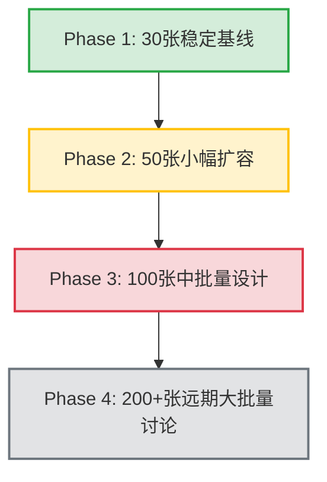

# Native 更大批量处理安全设计规划：CORE-DESKTOP-NATIVE-BATCH-SCALE-DESIGN-1

## 1. 背景
AI Photo Cleaner 目前在桌面端 (Native) 支持最大 30 张小批量照片的流畅、安全、稳健整理。随着用户照片库 management 需求的增加，后续需要将此处理能力逐步扩展至 50 张、100 张甚至 200+ 张的大批量处理。由于大批量处理会对系统的内存安全、隐私防泄露、UI 响应度及进程健壮性带来严峻挑战，特制定此安全设计规划，以指导后续的分阶段平滑扩容。

## 2. 当前稳定基线
- **基线 Commit**：`bc83e92 polish physical org dialog copy`
- **Git 状态/工作区状态**：除本设计文档（作为未跟踪文件）外，产品代码、Rust processing、batch limit、Tauri 权限均无修改，工作区其他部分完全干净。
- **Feature Flags**：`USE_SIGNAL_GROUPS_FOR_BATTLE` 必须保持为 `false`（使用 legacy 双路对比稳定算法驱动 Photo Battle）。
- **已实现的核心安全防线**：
  - Native folder picker 权限隔离。
  - Native 预览与 Canvas 串行分析。
  - 物理复制整理 (Physical Org Copy-Only) 的安全防线（防重叠检查、同名规避与全脱敏处理）。
  - 脱敏的 `report.json` 导出与单 PlanId 重复执行防护。

## 3. 当前 30 张架构观察
- **常数硬限制**：
  - Rust 预览限制：`PREVIEW_LIMIT = 30` (定义于 `src-tauri/src/lib.rs`)。
  - 前端分析限制：`NATIVE_PROCESSING_MVP_LIMIT = 30` (定义于 `src/context/PhotoWorkspaceContext.tsx`)。
  - 单张大文件限制：`MAX_FILE_SIZE_BYTES = 15MB` (定义于 `src-tauri/src/lib.rs`)。
- **串行执行机制**：
  - 在 `startAnalysis` 中采用 `for` 循环同步等待单张分析结果（Queue Depth = 1），通过 `await readNativePreviewBytes(...)` 和 `await analyzeImageFromBlob(...)` 完成，完全不进行并发读取。
- **内存优化与防泄露**：
  - 读取到的 `Vec<u8>` 在前端临时转为 `Blob` 后进行 Canvas 分析，分析完成立即释放相关 ObjectURL。
  - `bytes` 与 `Blob` **不进入 React State**，React 中仅保留脱敏后的 ID、URL Scheme 以及其他元数据，使得大容量的二进制数组可被 JS 引擎快速垃圾回收 (GC)。
- **特殊文件跳过**：
  - **HEIC / HEIF** 格式在前端匹配扩展名后直接标记为已跳过，状态设为 `keep`，不触发底层读取与分析。
  - **超大文件 (>15MB)** 在 Rust 层直接被安全拦截并返回错误，前端安全捕获异常，将其置为 `keep` 并附脱敏原因，同时增加跳过/失败计数器。
- **Native ZIP 禁用**：
  - 为防止大批量照片在 Web 端打包 ZIP 导致严重的浏览器堆溢出崩溃，当前 Native 数据源下，ZIP 导出已被逻辑硬性禁用，引导用户使用本地物理复制整理。
- **物理整理脱敏设计**：
  - 前端只传递脱敏后的标识（如 `Photo-001`）和临时生成的 Opaque Tokens，不向前端暴露任何真实的磁盘路径（如 `C:\Users\...`）或文件名，Rust 底层在内存中基于预览映射关系完成真实的物理复制，保障隐私安全。

## 4. 不做事项 (Non-Goals / Constraints)
为了确保扩容过程中的安全与稳定性，以下事项在本轮及后续扩容中**被严格禁止**：
- **禁止一步到位**：禁止直接将 30 张限制修改为 100 张或 200 张，必须分阶段验证。
- **禁止全量分析**：禁止一次性读取并全量分析整个文件夹的所有文件。
- **禁止并发读取**：禁止并发调用 `read_native_preview_bytes` 导致瞬时内存暴涨。
- **禁止内存占用**：继续禁止 bytes / Blob 进入 React State。
- **禁止 Web Worker**：此阶段及下一阶段继续禁止使用 Web Worker。
- **禁止 SQLite**：此阶段及下一阶段继续禁止使用 SQLite 等数据库依赖。
- **禁止 Native ZIP**：继续完全禁用本地 ZIP 压缩。
- **禁止破坏性整理**：物理整理继续采用 **Copy-Only** 模式，禁止执行任何物理 `move`、`delete` 或 `overwrite` 操作。
- **禁止 Tauri 权限越权**：不新增 Tauri 权限（保持当前的 dialog 等最小限度权限），禁止使用广域文件系统权限 (broad filesystem)、shell 权限或 allow-all。
- **禁止自定义协议越权**：禁止使用或修改资产协议 (assetProtocol / protocol-asset)。
- **禁止联网**：禁止接入任何联网 AI、Supabase、OpenAI API、后端或云端第三方服务（保持纯本地处理）。

## 5. 分阶段扩容路线

### Phase 1：保持 30 张稳定基线
- **目标**：当前的生产环境基线，不作任何改动。
- **作用**：作为所有后续实验性版本的最稳妥降级兜底方案 (Fallback)。

### Phase 2：50 张小幅扩容
- **目标**：进行小幅度的批量提升，验证在更高数量级下的内存与 UI 表现。
- **策略**：仍然保持串行读取、单张 15MB 限制、不并发，UI 明确显示“当前最多支持分析 50 张”。
- **发布**：先只对测试/内测分支开放，必须通过全套 QA 回归。下一阶段实现中仍然禁止 Worker、SQLite 及并发读取。

### Phase 3：100 张中批量设计
- **目标**：中等批量处理。
- **策略**：不建议直接实现。需要更强的进度管理、更清晰的失败与跳过统计、主动的内存风险监控以及中断/取消策略。
- **测试**：必须在真实的 100 张照片测试集下做性能与内存的 Profile 分析。

### Phase 4：200+ 张远期大批量讨论
- **目标**：超大批量整理讨论，仅为远期架构方向讨论，不属于 50 张扩容实现，不属于近期实现，不会在下一 checkpoint 引入。
- **策略**：现有的完全在内存中维持照片项列表的机制不适用。需要任务队列 (Task Queue)、分批扫描机制 (Chunked Scanning)、本地轻量索引 (SQLite/IndexedDB) 以及崩溃恢复机制 (Crash Recovery)。下一阶段仍禁止引入 SQLite / IndexedDB / Worker。

---

## 6. 50 张方案 (Phase 2)
### 6.1 设计细节
- 将 Rust 层的 `PREVIEW_LIMIT` 调整为 `50`。
- 将前端的 `NATIVE_PROCESSING_MVP_LIMIT` 调整为 `50`。
- **UI 提示**：在开始扫描前或扫描时，UI 提示“已选择本地相册，当前最多支持分析前 50 张照片”。
- **性能预期**：在串行 queue depth = 1 的情况下，处理 50 张照片预计耗时在 25s - 60s 之间，内存峰值应与 30 张一致。
- **降级开关**：如果设计中引入 Feature Flag（如 `NATIVE_BATCH_LIMIT_EXPERIMENTAL`），补充以下细节：
  - 是否新增 feature flag 需在后续 50 张实现 checkpoint 中单独确认，本设计文档不要求本轮或下轮立即新增。
  - 若最终确认新增，该 flag 也只能控制 30 / 50 的数量切换，必须保留 30 张 fallback 逻辑作为备用兜底。

---

## 7. 100 张设计风险 (Phase 3)
直接扩展至 100 张会引入以下风险：
- **垃圾回收滞后导致的内存溢出**：
  - 即使前端代码没有主动持有 Blob，V8 引擎的垃圾回收机制 (Garbage Collection) 是周期性触发的。若 100 张照片连续、高频地执行 Canvas 像素提取，大量的中间层 Blob 和 ImageData 可能在 GC 发生前积压，导致前端内存溢出 (OOM) 崩溃。
- **时间成本与无响应感**：
  - 100 张照片分析耗时可能达 1.5 - 2 分钟。必须在 UI 引入平滑的进度条与取消机制，并增加性能让步机制：例如每隔 10 张分析，使用 `await new Promise(r => setTimeout(r, 100))` 挂起 100ms，为浏览器留出 GC 运行和渲染 UI 的时间窗。

---

## 8. 200+ 张远期架构讨论 (Phase 4)
- **非近期实现声明**：本架构设计仅为远期方向讨论，不属于 50 张实现范畴，不属于近期实现，在下一阶段也继续禁止引入。
- **分批处理 (Chunked Analysis)**：前端一次只向 Rust 订阅并获取 20 张的 preview token，处理完成后释放，再订阅下一批，将内存中的活动图片项维持在极低阈值。
- **断点续扫与 Crash Recovery**：
  - 分析进度实时写入本地配置文件。如果应用意外崩溃或用户主动退出，下次重新选择该文件夹时，对比已存哈希，仅对未处理的图片增量扫，秒级恢复整理现场。

---

## 9. 内存与性能安全策略
- **串行管道**：读取、转换、像素提取、相似度检测全部采用串行管道。
- **生命周期拦截**：
  - 二进制流 `bytes` 仅在 Rust 桥接函数中作为局部变量存在，不存入 React。
  - 分析所用的 `Blob` 必须在 Canvas 分析完的 `finally` 块中立即被作用域丢弃，对应的临时 ObjectURL 需在 1 秒内 revoke。
- **UI 渲染控制**：
  - 进度 UI 需明确显示“已分析 X / N”，并提供跳过与失败计数。

---

## 10. 取消 / 中断策略
- **取消按钮**：在分析过程中，提供“停止分析”按钮。
- **打断逻辑**：当用户点击取消后，已完成分析的前 M 张照片的结果予以**保留**，未分析的 N - M 张照片标记为 `skipped` 并保持默认状态，但不作为淘汰候选。
- **数据流转**：用户可以在取消后直接点击“查看整理结果”进入结果页，查看已完成部分的整理建议。
- **物理整理防护**：物理复制时，未分析成功的照片将被静默跳过，仅对已明确分析结果的 Keep/Cull 照片执行物理复制，确保安全性。

---

## 11. 错误处理策略
- **异常拦截**：读取文件元数据或字节发生任何 IO 错误时，该文件应被标记为 `keep` 默认（并附加脱敏原因，如“读取本地文件内容失败”），不打断后续其他文件的串行扫描。系统绝对不引入任何第三状态，仅保留 `keep` 和 `delete` (淘汰候选) 分类。
- **信息脱敏**：前端捕获的错误日志中，绝对不能输出诸如 `C:\Users\username\Documents\...` 等真实的物理路径或文件名，一律脱敏为 `[读取本地文件内容失败]`。

---

## 12. UI 体验与文案设计
- **扫描页面信息**：
  - “本地处理，不上传云端，您的原图保持不变”
  - “已分析 X/N | 已跳过 Y 张”
- **结果页交互**：
  - 分析结束后展示“查看整理结果”按钮，禁止在分析结束时自动页面路由，将控制权交还用户。
  - 在 Results 面板顶部继续清晰告知：“原图保持不变，整理结果将复制输出到全新目录”。

---

## 13. QA 策略
后续 50 张扩容实现，必须严格通过以下 QA 步骤与策略方可发布：

### 13.1 初始状态与编译校验
- **Git 状态检查**：运行 `git status --short` 确认除目标修改外无其他杂乱文件。
- **基线差异校验**：运行 `git diff -- src/lib/config/featureFlags.ts` 确认 feature flags 未被非预期修改。
- **静态代码构建**：运行 `npm.cmd run build` 确保无前端编译、打包错误。
- **代码规范校验**：运行 `npm.cmd run lint` 确保无规范及类型警告。

### 13.2 运行回归测试
- **测试环境启动**：运行 `npm.cmd run desktop:dev` 启动 Tauri 桌面端调试器。
- **30 张基线回归**：首先导入包含 30 张图片的本地文件夹，验证核心流程（预览、处理、结果呈现、同名复制）完整无误。
- **50 张批量测试**：导入包含 50 张以上图片的本地相册，验证处理到 50 张上限时的行为符合设计预期（限制提示、进度条表现、最终生成 50 张的结果数据）。
- **Web 端功能回归**：
  - 测试网页端上传功能 (Web upload)。
  - 检查 Web 端结果页呈现 (Web Results)。
  - 测试 Web 端的 ZIP 导出、CSV 及 JSON 导出清单是否无异常 (Web ZIP / CSV / JSON)。
- **Demo 回归测试**：
  - 验证演示包的相似分组功能 (Demo Similar Groups)。
  - 验证演示包的 PK 流程 (Demo A-B)。

### 13.3 边界情况与大文件验证
- **混合格式测试**：准备包含 jpg、png、webp 混合格式的文件夹，保证均可正常被 Canvas 分析。
- **大文件跳过测试**：文件夹中混入大于 15MB 的大文件，确认其可被安全拦截为 `keep`（并显示对应已跳过原因），不崩溃不阻断流程。
- **HEIC / HEIF 格式跳过测试**：文件夹中混入 `.heic` / `.heif` 格式，验证前端匹配扩展名后能够正确优雅跳过，不阻碍其他格式的运行。

### 13.4 功能与隐私性检查
- **整理分组验证**：验证 Native Results 面板的相似照片分组 (Native Similar Groups) 和 PK 面板 (Native A/B) 是否完整可用。
- **复制结果验证**：验证本地物理复制整理 (Native copy-only physical org) 生成的目录结构与冲突重命名逻辑正确。
- **隐私脱敏检查**：检查物理复制生成会话目录下的 `report.json`，确保无任何物理路径、系统敏感名、原文件名的泄露。
- **安全拦截校验**：确认 Native ZIP 导出在本地数据源时仍处于逻辑禁用状态。

---

## 14. 推荐下一 Checkpoint
- `CORE-DESKTOP-NATIVE-BATCH-SCALE-50-IMPLEMENT-1` (Phase 2 的 50 张小幅扩容实现与全量 QA 验证)
