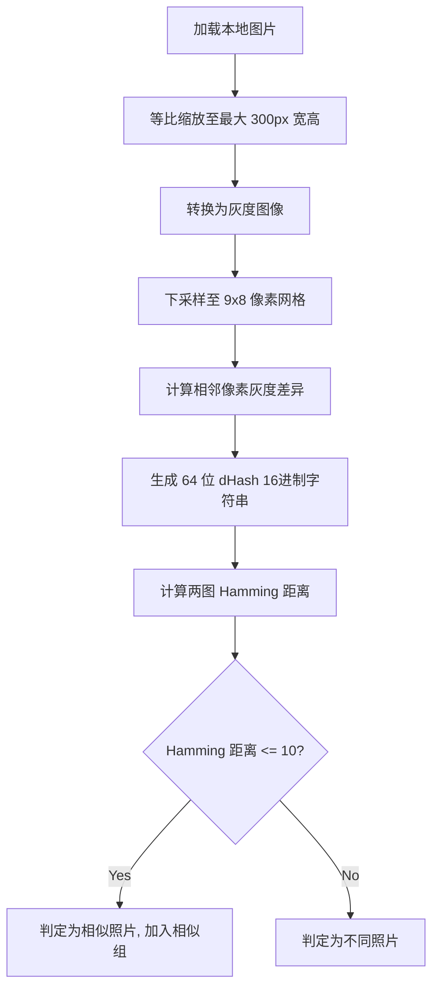

# Native 首次使用流程 UX 与相似照片识别设计诊断说明书 (修正版)

本说明书针对 AI Photo Cleaner 在 Windows 桌面端（Native）打包后，真实测试中发现的**首次使用流程停滞**以及**相似照片识别失败（相似重复 = 0）**等核心体验问题进行深度诊断，并给出第一阶段的最小可行性安全修复设计方案。

---

## 1. 背景与目标

在完成 Windows 安装包（NSIS/MSI）的打包并进行真实相册测试后，产品已具备完整的本地读取、脱敏诊断和 Copy-Only 整理输出能力。然而，首批用户体验反馈揭示了两个影响极大的痛点：
1. **分析完成后卡在 Processing 页面**：分析进度条走到 100%，但不会自动跳转到 Results 页，页面上无高亮提示，用户误以为程序卡死。
2. **相似照片识别失败**：即使载入了包含大量连拍和轻微角度变化的相似照片，系统依然显示“相似重复 = 0”。由于未正确触发本地相似识别，且 A/B 对局入口不够显眼，核心整理链路断裂。

本说明书经 Codex 评审及产品策略调整，**收紧了第一阶段的实现边界，暂缓自动弹窗及全量 A/B 设计，收紧相似阈值策略，并纠正了用户语义**，以确保开发人员获得安全、清晰、可实施的技术规范。

---

## 2. 用户真实测试问题归纳与修正

| 问题分类 | 问题描述 | 潜在风险 | 第一阶段解决方案与实现边界 |
| :--- | :--- | :--- | :--- |
| **完成页停滞问题** | 本地分析进度达到 100% 后停留在 Processing 页面，无法自动跳转至结果页。 | 产生“程序卡死”或“分析未成功”的严重误导。 | **自动流转**：分析完成后自动跳转至 Results 页，并在后台完成相似分组计算。 |
| **A/B 触发引导不足** | 结果页中，相似照片对局缺乏显眼的高亮操作引导。 | 整理核心漏斗中断，用户不知道有 A/B 筛选功能。 | **显眼 CTA 引导**：如果存在相似组，Results 页面展示明显的“开始 A/B 对比”主视觉 CTA 按钮；**不进行自动弹窗打断**。 |
| **相似重复数 = 0** | 肉眼可见的相似照片（如连拍、微移、亮度变化）在本地分析中完全无法被识别。 | 相似组列表为空，用户无法进行智能筛选。 | **恢复分组链路**：开启 Native 本地自动相似分组；**优化哈希阈值至 12，并搭配宽高比/尺寸门槛**。 |
| **选择照片问题** | 当前只能选择文件夹，不支持多选图片导入。 | 文件夹大图过多时存在加载性能风险。 | **本阶段暂缓**，保留文件夹选择作为稳定入口，后续 checkpoint 再作设计。 |
| **安装/卸载问题** | NSIS 安装包维护模式及卸载完毕后的重装循环。 | 损坏安装卸载体验。 | **本阶段暂缓**，归入后续 packaging 修复任务中单独处理。 |

---

## 3. 当前相似识别算法与管线观察

根据只读代码审计，当前系统的相似与重复照片识别基于 **dHash（差异哈希）** + **汉明距离（Hamming Distance）** 算法，其工作流如下：



### 3.1 核心算法参数与规则
1. **算法类型**：dHash（Difference Hash），侧重于边缘与渐变差异，计算速度快，适合本地轻量化执行。
2. **计算维度**：将 300px 灰度画布压缩成 9x8 图像，每行计算 8 个相邻像素的灰度差值（左 > 右为 1，反之为 0），产生 8 个字节的 64 位二进制指纹。
3. **汉明距离阈值**：在 [duplicate.ts](file:///C:/Users/khinl/Documents/AI%20Photo%20Cleaner/src/lib/analysis/local/duplicate.ts#L116) 中，相似判定阈值被固定为 **`10`**：
   $$\text{Hamming Distance} \le 10 \implies \text{Similar}$$
   即 64 位中如果有 10 位及以下不同，判定为相似。
4. **决策分配**：在相似组内选出质量分（qualityScore）最高的一张作为 Leader，其余照片为候选。

---

## 4. Native 与 Demo 差异分析

通过对比 Web 演示版（Demo）与本地桌面版（Native）的底层代码，发现了导致 Native 表现异常的**核心触发链路不一致**问题：

### 差异 1：分析流转与分组管线割裂 (关键病灶)
* **Demo/Web 模式**：
  在 [PhotoWorkspaceContext.tsx#startAnalysis](file:///C:/Users/khinl/Documents/AI%20Photo%20Cleaner/src/context/PhotoWorkspaceContext.tsx#L1443) 的尾部，分析结束后会自动运行 dHash 分组并将其写入 `similarGroups` 状态。
* **Native 模式**：
  当检测到 `hasNativeSource` 为 `true` 时，代码跳过了分组逻辑：
  ```typescript
  if (hasNativeSource) {
    setPhotos(updatedPhotos); // 直接保存, 未执行 detectDuplicates 和 initializeSimilarGroups
  }
  ```
  这直接导致 Native 扫描完成后，所有照片的 `duplicateGroupId` 为空，`similarGroups` 状态为 `[]`，这也是进度页及结果页显示“相似重复 = 0”的直接原因。

### 差异 2：Results 页面加载时的 A/B 触发逻辑差异
* **Demo/Web 模式**：
  在 [results/page.tsx#L487](file:///C:/Users/khinl/Documents/AI%20Photo%20Cleaner/src/app/results/page.tsx#L487) 的生命周期中，会自动检测并弹出 A/B PK 对局。
* **Native 模式**：
  该 Effect 存在显式拦截：
  ```typescript
  if (hasNativeSource) return; // Native 模式直接返回，禁止自动弹出 A/B PK 窗口
  ```
  第一阶段修复将**继续保持不自动弹出弹窗**以防打断用户，但必须**在 Results 页面中增加明显的 CTA 入口**（如高亮“开始 A/B 对比”按钮），使用户能够主动触发对局。

---

## 5. 相似识别失败的可能原因诊断

即便用户在 Results 页面中手动点击了 “识别本地相似照片” 按钮，仍然可能无法识别出相似照片。其深层技术原因诊断如下：

### 5.1 汉明距离阈值过严
* **诊断分析**：当前设定的阈值 `10` 对应相似度 $84.3\%$。对于真实连拍照片，微弱的角度倾斜、相机的轻微位移、或者拍摄主体的位移都会导致像素在 9x8 的低频网格中发生错位，从而使 dHash 翻转 11~13 位（相似度降至 $79.7\% \sim 82.8\%$）。
* **结论**：阈值 `10` 过于严苛。第一阶段建议调宽至 **`12`**（容错率 18.75%），以适配真实手抖与连拍偏差。

### 5.2 尺寸与 aspect ratio（宽高比）对 dHash 的负面影响
* **诊断分析**：
  在 [imageAnalysis.ts#L52](file:///C:/Users/khinl/Documents/AI%20Photo%20Cleaner/src/lib/imageAnalysis.ts#L52) 中，图片会被等比缩放到最大 300px：
  - 若照片 A 为 4:3 比例，照片 B 为 16:9 比例，在计算 dHash 时，其下采样网格的边界采样点由于宽高比不一致产生坐标偏移。
  - 即使是同一场景，只要构图宽高比稍有不同，就会导致提取到的 9x8 网格灰度比较关系被打乱，汉明距离暴增。
* **结论**：阈值放宽必须配合 aspect ratio 门槛，避免宽高比不同的两张完全不同的照片被强行归入相似组。

### 5.3 EXIF 旋转属性缺失或处理失真
* **诊断分析**：
  本地照片通过 Rust 读入字节流并转为 Blob URL，直接放入 Canvas 渲染。如果 WebView2 在处理 Blob 图像时没有正确应用 EXIF 旋转，原图是竖图但解析成了横图，与另一张已纠正方向的照片相比，其 dHash 差值将非常大，无法识别。

---

## 6. 第一阶段修复方案设计 (实现边界收紧)

根据 Codex 评估，第一阶段的实现必须严格收紧范围，不引入高风险的体验打断或数据语义混淆。

### 6.1 用户可见语义规范 (规避 review / delete 危险语义)
为了避免误导用户、让用户产生“软件会自动删除我的原图”的恐慌，必须严格规范用户界面（UI）中的所有文案：
* **禁止出现的用户语义**：
  - 禁用 `review`（复核）、`delete`（删除）以及“未决定”等危险或含义模糊的词汇作为用户可见的主分类。
* **统一使用的用户可见分类**：
  - **`Keep` (保留)**：代表质量良好或用户决定保留的照片。
  - **`淘汰候选`**：代表存在质量风险、或在 A/B 挑选后被作为备选的照片。
* **内部技术说明与日志规范**：
  - 仅在内部代码日志或技术调试信息（如 `report.json` 的技术属性或控制台）中使用 `skipped` (已跳过)、`internal grouping` (内部相似组分组)、`candidate bucket` (候选分类桶) 等中性专业词汇，绝不对普通用户暴露。
* **安全文案强调**：
  - Results 页面及物理复制确认页必须加粗强调：**“本软件采用复制整理（Copy-Only），绝不会物理删除或改动您的任何原始图片文件，请放心操作。”**

### 6.2 相似哈希算法调优 (阈值放宽 10 -> 12 + 尺寸宽高比门槛)
* **汉明距离阈值放宽**：
  - 第一阶段相似检测判定阈值从 `10` 调宽至 **`12`**，提供约 18.75% 的容错率，用于召回真实连拍和微移图片。
  - **禁止直接上调至 13**。13 仅作为后续研究和进一步实验参数，当前阶段不进入代码实现。
* **引入宽高比与尺寸安全边界 (Aspect Ratio Safety Gate)**：
  - 在计算汉明距离前，必须校验两张照片的宽高比差异。
  - 判定规则：仅在宽高比相对偏差不超过 **5%** 的照片之间进行哈希距离计算。
    $$\left| \frac{W_1}{H_1} - \frac{W_2}{H_2} \right| \le 0.05 \times \frac{W_1}{H_1}$$
  - 若超出该范围，直接判定为“不相似”，跳过哈希比较。这样可以物理隔离横版图与竖版图，防止由于尺寸或方向偏差导致的哈希错位误分组。

### 6.3 分析完成后的流转与 A/B 触发策略
* **自动跳转 Results**：
  - 移除 Native 数据源的页面跳转拦截。当 `analysisProgress === 100` 且分析结束时，延时 1.2~1.5 秒**自动路由跳转**至 `/results` 结果页。
* **自动执行分组**：
  - 在 Native 分析到达 100% 时，在后台自动执行 `detectDuplicates` 及 `initializeSimilarGroups`，将分组结果正确写入 `similarGroups` 状态中。
* **Results 页面 A/B 触发设计 (不打断原则)**：
  - **禁止第一阶段进行自动弹窗式 A/B PK 对局**。无论是否存在相似组，均不自动弹出 PK 弹窗，防止粗暴打断用户的主动流览。
  - **提供明显 CTA 入口**：在 Results 页面（特别是在“整理结果”摘要区及相似组列表顶部）渲染一个显眼的视觉引导按钮，文案为 **“开始 A/B 对比”**。用户点击该按钮后，才手动拉起 A/B PK 弹窗。
  - **无相似组提示 (Similar Groups = 0)**：
    如果后台未发现任何相似照片（`similarGroups.length === 0`），Results 页面不启动 A/B，并且在相似组区域展示明确的引导提示：
    > **“未发现足够相似的照片组，因此不会自动进入 A/B。您已完成全部整理，可以直接进行本地整理输出或查看结果。”**
    避免用户处于信息空白状态，误以为程序卡死或故障。

### 6.4 明确第一阶段禁止/暂缓实现项
为了控制代码稳定性，以下功能**绝对不纳入第一阶段的实现范围**：
1. **不进行全量 A/B 模式**：第一阶段的 A/B 依然仅依赖客观的 `Similar Groups` 结果，不支持用户手动将完全不相似的照片强行拖入 A/B。
2. **不修改 Copy-Only 行为**：不改变现有的物理复制安全限制，坚决不使用 `move`、`delete` 或 `overwrite` 覆盖指令。
3. **不更改 report schema**：导出的 `report.json` 的脱敏结构和数据格式保持不变。
4. **不新增 Tauri 权限**：不修改 `capabilities/default.json` 权限配置，不新增广域文件访问权限。
5. **不进行选择照片（多选图片文件）入口的开发**：保持当前文件夹选择作为稳定入口。
6. **不进行 Installer 卸载修复的开发**。

---

## 7. 后续实现 Checkpoint 拆分

我们将后续的开发实现调整并拆分为以下几个合理的 Checkpoint：

### Checkpoint 1: CORE-DESKTOP-NATIVE-SIMILAR-GROUPS-FIRST-RUN-FIX-1
* **实现目标**：完成 Native 首次使用流程的流转修复及相似组算法基础微调。
* **实现范围**：
  - 启用 Native 分析完毕后的后台自动 `detectDuplicates` 分组及 `initializeSimilarGroups` 初始化。
  - 启用分析完成后自动跳转至 Results 页面。
  - 调整 dHash 阈值从 `10` 到 `12`。
  - 增加 5% 宽高比（Aspect Ratio）对比过滤门槛。
  - 在 Results 页面添加明显的“开始 A/B 对比”主视觉 CTA 引导按钮，去除自动弹窗行为。
  - 添加 `similarGroups.length === 0` 时的无相似组明确文案提示。

### Checkpoint 2: CORE-DESKTOP-NATIVE-BATTLE-CTA-TUNING
* **实现目标**：精细化 Results 页面 A/B 交互流程与用户决策撤销（Undo Action）的稳定性回归。

### Checkpoint 3: CORE-DESKTOP-NATIVE-WINDOWS-PACKAGING-UNINSTALL-FIX
* **实现目标**：解决 NSIS 卸载循环和覆盖安装时的维护模式问题，更新发布包配置。

---

## 8. QA 测试方案

在 Checkpoint 1 实现完成后，需按以下流程进行手动 QA 回归测试：

### 11.1 测试样本准备
* **连拍测试组**：在同一地点连续微移拍摄的 5 张 JPG 图像。
* **横竖图混合组**：同一主体，但包含 2 张横向和 2 张纵向拍摄的相似照片。
* **异构尺寸组**：同一照片经过不同构图裁切，宽高比相对差异 > 10% 的照片。
* **格式干扰组**：混入损坏的图片、大于 15MB 的图片以及 HEIC/HEIF 图片。

### 11.2 预期行为回归标准
1. **自动流转回归**：导入照片点击开始分析，进度条达到 100% 后，系统必须在 1.5 秒内自动跳转到 Results 页，不残留于 Processing 页面。
2. **算法精准度回归**：
   - 连拍测试组内的 5 张照片必须能够自动识别出相似组，且汉明距离应落在合理区间。
   - 横竖图混合组中，横图与竖图之间必须被 aspect ratio 门槛过滤，不能被合并为同一个相似组。
   - 异构尺寸组中，由于宽高比差异过大，不应该发生哈希碰撞误分组。
3. **Results 页交互回归**：
   - 若有相似组，Results 页面加载后**绝对不能自动弹出 A/B 弹窗**。页面必须渲染“开始 A/B 对比”CTA。点击该按钮后可顺利开始对局。
   - 若无相似组，页面呈现“未发现足够相似的照片组”的说明框，指引用户直接导出。
4. **格式干扰回归**：超大图与 HEIC 被安全标记为跳过，损坏图标记失败，不中断分析进程，不参与相似组对比。
