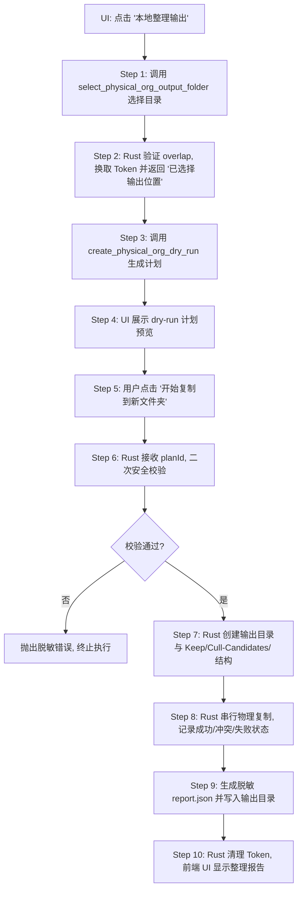

# Native 本地物理整理：只复制（Copy-Only）执行阶段安全设计方案 (Revised)

本设计方案规划了 AI Photo Cleaner 桌面端（Tauri）从“整理计划（Dry-Run）”安全推进到“真实只复制执行（Copy-Only Execution）”的完整设计。核心目标是在**完全不修改、不物理移动、不物理删除用户原图**的前提下，让用户将整理决断（保留照片/淘汰候选照片）物理备份并组织到新的目标输出位置。

---

## 1. 真实 Copy-Only 执行边界 (Safety Boundaries)

### 1.1 允许的操作
- **只复制（Copy-Only）**：从源文件夹仅读取文件，在新文件夹下写入副本。源相册原图绝对保持只读。
- **动态文件寻址**：Rust 侧内部通过 `photoId` 查找 `PREVIEW_MAPPING` 以获取文件实际绝对路径。
- **输出位置寻址**：Rust 侧内部通过 `outputFolderToken` 查找已授权的绝对输出目录路径。
- **脱敏执行报告**：执行完成后返回脱敏的 Execution Result 统计和条目报告。
- **失败隔离**：单张照片复制失败不影响其他照片复制。

### 1.2 严禁的操作（安全禁线）
- **禁止移动（Move）**：任何情况下不执行文件剪切、原目录重命名或删除。
- **禁止删除（Delete）**：绝不执行任何 `fs::remove_file` 或 `fs::remove_dir` 操作。
- **禁止覆盖（No Overwrite）**：若输出目录下已存在同名目标文件，不直接覆盖已有文件，采用冲突命名方案或独立 Session 目录隔离。
- **禁止写回源文件夹**：禁止输出文件夹等于或嵌套在源文件夹内（检查 `==`、`starts_with` 两个方向）。
- **禁止参数泄露**：前端 API 请求和响应、控制台输出、错误日志一律不传递、不打印物理绝对路径、用户名、盘符或原始文件名。

---

## 2. Tauri 权限方案 (Tauri Capability Scheme)

### 2.1 当前 copy-only MVP 首选权限方案

1. **前端权限**
   - 前端**没有**文件系统（filesystem）直接写权限。
   - 前端**不接** `tauri-plugin-fs` 插件。
   - 前端不向后端传递 `fullPath` / `sourceFolder` / `outputPath` 等任何物理绝对路径，仅传递 `planId`。
   - 前端只展示脱敏后的 `executionResult`。
   - 不采用前端 fs 插件写入方案；copy-only MVP 的真实复制应由 Rust command 在后端内部执行，前端只触发 planId，不获得文件系统路径或写入能力。

2. **Dialog 权限**
   - Dialog 仅用于用户主动触发本地系统选择 output folder。
   - Dialog 仅负责返回用户所选的真实物理路径到 Rust 内存的 token 映射表中，Dialog 自身不被描述为写权限的来源。
   - UI 侧仅接收到脱敏后的 `outputFolderToken` 标识符和 `"已选择输出位置"` 的文字展示标签。

3. **Rust Command 权限边界**
   - 物理复制的实际写操作仅在 Rust command 内部（后端）执行。
   - Rust 内部通过读取 active source session map、outputFolderToken map、dry-run plan map 获取路径。
   - Rust 内部执行规范化 `canonical` 安全路径校验与重叠校验。
   - Rust 侧不向前端返回、向控制台打印任何绝对物理路径。

4. **Tauri Capability 范围**
   - 当前阶段仍不新增 capability，保持极小集：
     - `core:default`
     - `dialog:allow-open`
   - 不新增 `fs` 插件、不新增 `shell`、不新增 `allow-all`、不新增宽泛文件系统权限（broad filesystem）、不启用 `assetProtocol` / `protocol-asset` 等权限。
   - 若未来由于特定安全模型或底层编译要求必须引入 `fs` 写入 capability，必须另开 Checkpoint 进行评估与设计：
     - 细化审查所引入的插件名、具体 capability 声明及其最小授权限制。
     - 明确设计 scope 生命周期和随时撤销策略，防止写范围溢出，确保前端依然无写权限。
     - 在该单独 checkpoint 获得评审通过前，严禁手动或工具修改 capability 的 default JSON 配置。

---

## 3. 执行流程 (Execution Workflow)



### 3.1 二次安全校验细则
在 Rust 接收到 `execute_physical_org_copy` 的执行请求后，**必须在物理复制前**执行以下防线检查：
1. `planId` 与对应的 `outputFolderToken` 必须合法且在内存中强绑定匹配。
2. 再次执行 Canonicalize 检验：
   - 检验输出物理路径不为空且仍然存在。
   - 再次校验输出物理路径是否与源物理目录 `ACTIVE_FOLDER` 产生任何层级交叉或重合。如果交叉，立即抛出错误并安全退出。
3. 检查源文件可读性，对发生缺失/修改的文件将其状态标为 `skipped` 并记录原因，不终止全局流程。

---

## 4. 执行接口设计与生命周期 (API & Plan Lifecycle)

### 4.1 执行命令接口
```rust
#[tauri::command]
fn execute_physical_org_copy(plan_id: String) -> Result<PhysicalOrgExecutionResult, String>;
```
- **唯一入参**：只接受 `plan_id`。
- **严格禁止**：不接受 `outputFolderToken` 作为执行入口参数（避免前端拼接或替换执行上下文），不接受任何 `fullPath`、`outputPath`、`sourceFolder`、`basename` 等。
- **后端定位**：Rust 内部通过 `plan_id` 自动定位到已通过 dry-run 模拟生成的计划。
- **安全检查**：
  - 确认该计划中关联的 `outputFolderToken` 依旧有效。
  - 确认该计划状态尚未被执行过。
  - 若 `outputFolderToken` 失效或对应路径不存在，立即抛出脱敏错误。

### 4.2 计划与 Token 的生命周期

- **强映射绑定**：在 Dry-Run 阶段生成的 plan 必须与当时的 `outputFolderToken` 进行 1:1 强绑定。在执行阶段，不支持也不接受新的 `outputFolderToken` 参数替换当前的上下文。
- **状态机流转**：
  Plan 需引入明确的状态以记录生命周期：
  - `planned`：计划已生成且验证通过，等待执行。
  - `executing`：正在执行中。
  - `completed`：执行已完成。
  - `failed`：执行遇到阻断性错误失败。
  - `expired`：因会话重置或超时过期。
- **一次性执行**：每个 `plan_id` 关联的计划仅允许执行一次，不可重复提交执行。
- **会话清理**：
  调用 `clear_physical_org_session` 命令时，Rust 内存中会同步销毁：
  - `outputFolderToken` 映射表
  - `dry-run plan` 映射表
  - `execution result` 缓存数据
- **级联失效**：如果用户的 active native preview session（源文件夹）发生切换或重新加载，之前生成的所有 dry-run plan 及对应的 `outputFolderToken` 映射关系必须立刻被强制废弃失效。

---

## 5. 目录结构与隔离 (Directory Structure)

在真实写入时，Rust 仅在用户选择的输出位置内进行操作，格式示例如下：

```
<Selected Output Folder>/
  AI Photo Cleaner Export/
    export-session-<timestamp>-<hash>/
      Keep/
        Photo-001.<ext>
        Photo-002.<ext>
      Cull-Candidates/
        Photo-003.<ext>
      manifest.json
      report.json
```

### 设计说明
- **UI 脱敏**：UI 上自始至终不显示 `<Selected Output Folder>` 真实绝对路径，只显示 `"已选择输出位置"`。
- **唯一 Session 隔离**：在 `AI Photo Cleaner Export/` 下创建带有时间戳和哈希的独立 `export-session` 文件夹，从而使每次物理整理操作天然物理隔离，避免多次导出相互干扰。
- **文件名脱敏**：文件输出名统一采用与前端对应的 `Photo-XXX` 格式（如 `Photo-001.jpg`、`Photo-002.png`）。
- **后缀名安全识别**：后缀名由 Rust 在后台基于源文件真实 Path 后缀进行提取，不可由前端传入或自行拼接。

---

## 6. 冲突处理设计 (Conflict Handling)

虽然 `export-session` 目录能够有效减少多次导出的冲突，但为防止用户在同一个文件夹内多次写入或手动干扰，我们设计如下重名冲突防线：
- **不覆盖**：严禁采用直接覆盖写入（如 Rust `std::fs::copy` 遇同名文件默认覆盖）。
- **重试重命名法则**：
  若检测到目标文件名（例如 `Keep/Photo-001.jpg`）在当前 session 目录中已存在：
  1. 自动尝试命名为 `Photo-001-1.jpg`。
  2. 若仍存在，累加计数器直至 `Photo-001-N.jpg` 可用。
- **报告记录**：冲突重命名结果必须记录到报告，格式为 `Photo-001-1.jpg`，不泄露源文件的真实名字。

---

## 7. 失败处理设计 (Failure Handling)

- **单张容错**：某张文件因损坏或只读锁定复制失败时，Rust 侧应捕获该 error，将该文件的执行结果标记为 `failed` 并附带脱敏原因（如 `"源文件被系统锁定"`），然后继续复制下一张照片。
- **中途灾难性断电/中断**：
  - 物理复制不执行任何 rollback 物理回滚（因为删除已复制文件增加写操作风险）。
  - 已写入的文件安全保留在输出目录下。
  - 再次打开软件或生成整理计划不受影响。
- **写操作无权限或输出盘空间不足**：
  - 在复制第一张卡片或创建目录失败时，立即整体终止，退出并返回脱敏的系统错误代码（如 `[Err-204] 输出位置不可写入或空间不足`）。

---

## 8. 数据结构 (Data Structures)

### 8.1 PhysicalOrgExecutionRequest (执行请求)
```typescript
interface PhysicalOrgExecutionRequest {
  planId: string;
}
```

### 8.2 PhysicalOrgExecutionResult (执行结果)
```typescript
interface PhysicalOrgExecutionResult {
  planId: string;
  executionId: string;
  outputDisplayLabel: "已选择输出位置";
  totalItems: number;
  copiedCount: number;
  skippedCount: number;
  failedCount: number;
  warnings: string[];
  reportItems: Array<{
    photoId: string;
    displayName: string; // 例如: "Photo-001"
    targetBucket: "keep" | "cull-candidate";
    outputRelativePath: string; // 例如: "Keep/Photo-001-1.jpg"
    status: "copied" | "skipped" | "failed";
    reason?: string;
  }>;
}
```

---

## 9. UI 文案约束 (UI Copy Restrictions)

### 9.1 允许作为操作按钮 / 说明文案
- “开始复制到新文件夹”
- “原图保持不变”
- “复制完成”
- “部分照片未复制”
- “查看整理报告”
- “导出整理报告”
- “保留照片”
- “淘汰候选照片”
- “不会移动或删除原图。”

### 9.2 绝对禁止作为按钮 / 入口 / Tab 名
- “删除” / “自动删除”
- “清理” / “清理废片”
- “恢复原图” / “找回照片”
- “文件丢失”

---

## 10. 验收标准 (Acceptance Criteria)

未来实现真实 Copy-Only Execution 时，必须全部满足以下技术验收指标：
1. **零文件改动**：源文件夹的原始图片及其子目录结构绝对不发生任何写入、移动、改名或删除。
2. **完全 Copy-Only**：只进行读取源图并写入到新目标文件夹的操作。
3. **二阶段流程约束**：不可以直接执行 Copy，必须先触发 Dry-run 生成 plan 并经用户二次点击后方可触发执行。
4. **源与目标重叠拒绝**：如果用户选择 the 输出位置与源文件夹为同目录、父子目录或交叉目录，系统强力拦截并返回安全拒绝信息。
5. **不覆盖已有资产**：输出端遇同名冲突时，自动按 `Photo-XXX-N` 规则重新安全命名，不覆盖输出端的任何已有文件。
6. **无泄露隐私**：控制台 Console、编译日志、UI 文本以及生成的 `manifest.json` / `report.json` 中一律不包含任何真实物理绝对路径、用户名、盘符或真实文件名。
7. **回归测试通过**：
   - Next.js 构建与 Eslint 静态扫描无错。
   - Tauri 本地编译通过。
   - Web 和 Demo 模式维持独立运行，功能完好不退化。
   - Native ZIP 功能依然被安全禁用。
