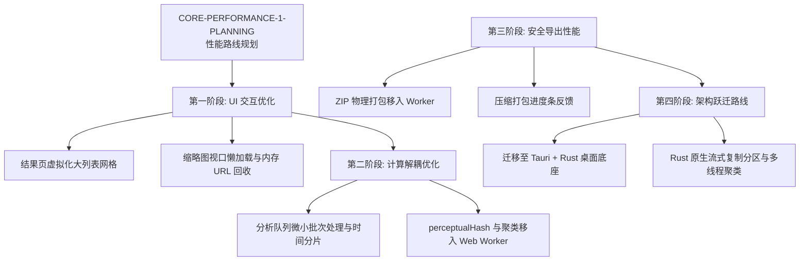

# AI Photo Cleaner 性能优化规划 - CORE-PERFORMANCE-1-PLANNING

## 一、 当前性能基线

项目目前已经完成了 100 张、200 张和 300 张真实 JPG / PNG / WebP 混合格式图片在开发环境下的 true 分支物理压测，其基础运行表现如下：

1. **100 张混合格式测试**：顺利通过。双路算法指标（组数: 15 / 15，照片总数: 60 / 60，组长差异: 0）Parity 100% 对齐，ZIP 导出与擂台交互正常。
2. **200 张混合格式测试**：顺利通过。
   - `/processing` 图像解码与分析阶段总耗时：17.65 秒。
   - 双路聚类算法比对指标完全一致（old/new group count: 30 / 30，photo count: 120 / 120，leaderMismatchCount: 0）。
   - ZIP 分区导出与擂台表决响应流畅，无页面卡阻。
3. **300 张混合格式测试**：顺利通过。
   - `/processing` 图像解码与分析阶段总耗时：26.04 秒。
   - 双路聚类算法比对指标完全一致（old/new group count: 45 / 45，photo count: 180 / 180，leaderMismatchCount: 0）。
   - **出现性能预警**：跳转并首次渲染 `/results` 网格大列表卡片时，主线程占用率极高，滚动网格时出现了轻微掉帧，表明浏览器原型性能已触及舒适交互上限。
4. **功能闭环情况**：Photo Battle 擂台对决、skip 决断、reset 恢复以及 ZIP 打包压缩在三档测试中均功能完好，且导出的 ZIP 保留了原始图片的 JPG / PNG / WebP 后缀与物理格式。
5. **用户可见分类约束**：用户可见的最终整理归宿依然强制收敛为“保留”与“淘汰候选”两类。

### 结论
- 新版相似信号聚类算法的逻辑正确性已通过中等规模的物理压力验证，双路对齐表现优秀。
- 系统的主要痛点已经不再是客观算法的正确性，而是浏览器环境下的**物理性能极限与主线程负载阻碍**。
- **极不建议在当前架构下继续进行 500+ 大批量图片的盲目压测**。
- 系统的下一步演进重点必须正式转向**核心性能结构的重构与优化规划**。

---

## 二、 性能瓶颈来源分析

在中批量（200 / 300 张）真实图片压测中，浏览器的潜在性能瓶颈主要集中在以下 7 个物理层面：

1. **主线程负担过载**：浏览器主线程同时承担着文件读取、图片异步解码、Canvas 画布绘制重绘、dHash 感知哈希聚类、综合清晰度算分、React 状态更新以及 DOM 节点渲染重绘任务，极易引发事件响应排队与假死。
2. **Canvas 像素高频读取**：通过 Canvas 获取图像的 `ImageData` 是物理同步操作。在大批量图片短时间内排队调用 `getImageData` 时，主线程会被硬性阻塞。
3. **O(n²) 级连通图聚类查找**：在检测相似对决组时，汉明距离两两比对在最坏情况下的计算复杂度为 $O(n^2)$。当照片规模增加到 300+ 甚至 500+ 时，两两比对的次数将急剧增长。
4. ** results 页面 DOM 节点树膨胀**：对于 300 张图片，页面在一瞬间会生成超过 300 个包含多重控制按钮、信息标签和高清晰度大缩略图的卡片 DOM，重绘压力极大，导致滚动掉帧。
5. **缩略图瞬间解码与装载**：在扫描分析结束后，结果页面一次性拉取并渲染全部图片的 base64 缩略图，导致浏览器瞬间产生巨大的物理内存波峰。
6. **主线程 ZIP 物理压缩**：JSZip 在主线程中执行文件压缩和 Blob 数据整理。在大批量、多压缩格式文件导出时，会直接造成主线程阻塞数秒，界面完全失去响应。
7. **大对决队列的状态流转开销**：当 PK 组数达到 45 组时，每次表决（如 `keep_left`）导致的 React Workspace Context 状态局部重绘以及二值卡片分组移动成本叠加，使交互响应迟缓。

---

## 三、 优化方向一：Web Worker 后台分析

### 1. 目标
将最消耗算力、高内存占用的计算密集型任务（文件读取、特征提取、Perceptual Hash 生成、拓扑相似聚类等）完全剥离主线程，移入独立的 Web Worker 进行并行计算，彻底解放主线程用于流畅的 UI 交互与响应。

### 2. 规划方案
- **主线程（UI 主线程）**：仅负责文件 File 对象的拦截与传递、分析进度条百分比反馈、Results 页面 UI 卡片装载、对决擂台状态机展示、以及 ZIP 导出的保存拦截。
- **Web Worker（计算子线程）**：
  - 维持分析队列，采用管道化任务调度。
  - 使用 `OffscreenCanvas`（在支持的环境中）或进行分段异步重绘计算清晰度与清晰边缘哈希。
  - 计算每张照片的 perceptualHash (pHash/dHash) 信号。
  - 在后台进行 O(n²) 距离计算与 BFS 连通分量图相似聚类，计算出 QA 相似组对比结构。
- **输出规范**：Worker 返回的数据必须是纯客观分析层（Analysis Layer）的计算信号，严禁携带 displayLabel、reasonLabel 等中文文案及最终状态。

### 3. 潜在风险与 fallback 策略
- **DOM 依赖解除**：Worker 中无法访问 `window`、`document` 以及常规 `HTMLCanvasElement`。必须使用 `OffscreenCanvas`，对于不支持该 API 的旧版浏览器需要 fallback 退回主线程的微批次队列处理。
- **数据序列化开销**：在主线程与 Worker 之间传输海量大图 Blob 数据可能产生序列化延迟。需采用 **Transferable Objects**（可转移对象，如 ArrayBuffer）进行零复制的内存所有权转移。

---

## 四、 优化方向二：分批处理与微任务化

### 1. 目标
避免一次性将上百张图片堆入分析通道导致浏览器瞬间假死。通过将分析队列拆分为若干微小批次并引入时间分片，保证浏览器主线程可以在分析间隔正常调度。

### 2. 规划方案
- **微队列处理**：规划将大列表文件按 20 张为一物理批次（或根据单张文件物理大小动态调整批次大小）进行分批。
- **时间分片让出**：每一批次分析完毕后，使用 `setTimeout(..., 0)` 或 `requestIdleCallback` 让出主线程，让浏览器能够处理 UI 重绘和用户取消按钮事件。
- **精细化进度反馈**：进度条不仅显示百分比，还展示当前批次进度（如：“正在分析第 3 / 15 批照片...”），优化用户等待心智。
- **可取消支持**：在让出主线程的间隙中，允许检测全局 `cancelRef` 标识，支持随时中断分析队列，安全释放已占用的 Canvas 及特征值内存。

---

## 五、 优化方向三：虚拟列表 / 虚拟网格（Virtual Grid）

### 1. 目标
通过在 DOM 树中仅保留当前视口（Viewport）内可见的照片卡片节点，使 DOM 树节点数保持在常量 $O(1)$，解决 references 膨胀和 results 滚动掉帧的问题。

### 2. 适用区域
- `/results` 页面“保留区”大网格卡片列表。
- `/results` 页面“淘汰候选区”网格卡片列表。
- 底部的胶片辅助缩略图工具带。

### 3. 预期收益
- 无论导入 300 张还是 1000 张，主渲染网格在 DOM 树中的节点个数始终保持在 15-30 个（根据视口大小而定）。
- 滚动时仅重绘图像链接与少量状态 Badges，卡片滚动掉帧完全消除。
- 浏览器整体渲染内存保持稳定。

---

## 六、 优化方向四：延迟与懒加载缩略图生成

### 1. 目标
消除在 `/processing` 分析阶段一次性将全部缩略图转为 base64 存入 Context 状态带来的海量内存浪费。

### 2. 规划方案
- **按需加载原则**：
  - 在扫描分析期间，不生成任何 Base64 缩略图，仅提取文件元数据（metadata）及客观相似特征。
  - 在进入 `/results` 结果网格后，使用 `IntersectionObserver` 监测卡片是否可见。
  - 当卡片滚动进视口时，才通过 `URL.createObjectURL(file)` 异步为 `` 标签生成内存 URL。
  - 当卡片移出视口时，可执行 URL 释放与懒回收，避免数个 10MB+ 原图在内存中长期驻留。
  - 在 Photo Battle 擂台对战中，仅为当前正在决斗的 2 张照片及其上下游各一张对局装载清晰缩略图。

---

## 七、 优化方向五：ZIP 分批 / 流式 / 后台导出

### 1. 目标
消除下载 ZIP 时主线程长达数秒的死锁，解决大批量文件（>300张）压缩时浏览器假死问题。

### 2. 规划方案
- **异步 Worker 打包**：将 JSZip 压缩任务及物理打包工作完全转移至后台 Web Worker 执行。
- **导出进度条**：通过 Worker 传输打包百分比，展示“正在打包保留区第 X/Y 张照片...”，提升用户安全感。
- **分立与归档隔离**：将保留区与淘汰区包彻底异步隔离。
- **原生 Tauri 导出方案（最终路线）**：由于浏览器端 JSZip 最终仍需要将打包后的 Blob 塞入主内存下载，物理上限受到浏览器沙箱分配强限制。未来在迁移至 Tauri + Rust 后，直接调用 Rust 的 `fs` API，执行底层的多线程流式文件复制、新建文件夹并归档，完全消灭 ZIP 压缩的性能开销与下载假死。

---

## 八、 优化方向六：相似检测客观预筛选

### 1. 目标
将 Perceptual Hash 比对的计算开销从最坏情况的 $O(n^2)$ 降低到接近线性的 $O(n)$。

### 2. 规划方案
- **感知哈希分桶（Hash Bucket Pre-Filtering）**：
  - 基于 dHash 的前 16-bit 或 32-bit 对照片特征进行前置分桶分类。
  - 仅在相同或相近（Hamming 距离在粗筛阈值内）的 bucket 内进行精确两两比对，完全过滤掉风马牛不相及的风景与人物大图比对。
- **元数据时序前置拦截（Metadata Temporal Gridding）**：
  - 如果照片包含 Exif 等创建时间，可根据拍摄时间区间（例如 1 分钟内的连拍）做时序分组粗筛。
  - 仅对时序相近的照片进行感知哈希特征比对，极大缩减矩阵计算开销。
- **Tauri Native 底座算法升级**：未来在 Tauri 环境下直接利用 Rust 的图像多线程并行处理库（如 rayon）或引入 OpenCV 对特征点进行聚类（如 K-Means 或 DBSCAN 密度聚类），达到数十倍的高速运算。

---

## 九、 性能重构实施路线图

性能重构建议遵循“UI 性能在前，核心计算在后，系统底座收尾”的物理分期顺序逐步实施：

### 实施阶段明细
- **第一阶段：UI 交互优化**：主要解决 results 页面滚动掉帧和大量图片 DOM 树过载的问题。安全风险极低，不改动任何核心状态。
- **第二阶段：计算解耦优化**：将主线程分析过程微小批次化，解决页面假死；随后利用 Web Worker 彻底剥离主线程。
- **第三阶段：安全导出性能**：将打包任务移入 Worker，防止导出期间界面死锁。
- **第四阶段：架构跃迁路线**：跳出浏览器 Web 限制，全面转向 Tauri 桌面原生端开发。

---

## 十、 下一阶段 Checkpoint 规划

性能优化路线应通过以下 Checkpoint 逐步规划与推进：

1. **`CORE-PERFORMANCE-1-QA`（性能规划审查）**：
   - Codex 对本规划文件进行只读安全性与实施边界审计，确认无 src 代码变动且 flag 极值保持 `false`。
2. **`CORE-PERFORMANCE-2-PLANNING`（ results 虚拟网格设计）**：
   - 规划 results 页面的虚拟网格（Virtual Grid）及懒加载缩略图方案，定义滚动检测边界，绝不改写业务状态机。
3. **`CORE-PERFORMANCE-3-PLANNING`（分批处理与进度条优化设计）**：
   - 设计分批导入文件、时间分片让出主线程、以及取消分析队列的状态流转设计。
4. **`CORE-PERFORMANCE-WORKER-1-PLANNING`（计算 Worker 消息通道规划）**：
   - 设计 Web Worker 离线计算层和 Transferable Objects 传输协议，规划双向数据交互信道（Message Channel）。
5. **`CORE-EXPORT-PERFORMANCE-1-PLANNING`（异步 Worker 打包设计）**：
   - 设计后台 Worker 压缩打包方案与打包中途进度条 UI 反馈，确保 UI 全程可控。
